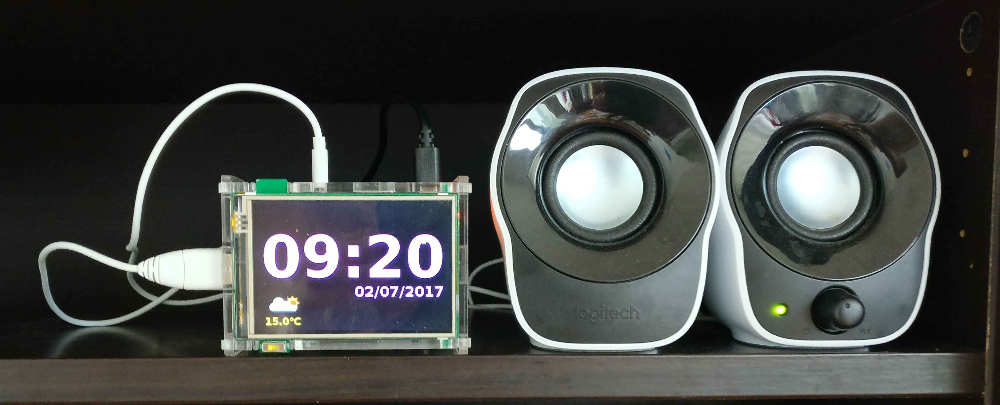

# Internet Radio

This is a custom made internet radio. The software is completelly free (with the
exception of the raspbian kernel, which might contain some blobs). The idea
behind it was to have an internet radio totally independent. This means it
doesn't depend on any server, I can modify the software whenever I want and it
has a decent music on demand service (`youtube`).

## Plug it and play

As a hardware, you need a raspberry pi model 3 (the installation instructions
for the software reffer to raspberry pi model 3), a touch screen with a box to
fit in the pi and the screen, a USB charged, a mini sd card and some speakers.
Of course, in theory you can use any screen, speakers or sd card, but I will
list the hardware on which the system has been tested and for which you are sure
that the premade software package will work. If you want to change the
hardware, you will need to follow the `build` instructions to build the software
from 0, or you can install the current software, ssh to the pi and modify the
software. If you want to use another screen, please note that the interface is
optimized for a 480x320 resolution and has only been tested with a 480x320 or
320x240 resolution. If you want a bigger resolution, you will need to build the
application from 0 and to change the `CSS` and `PNG` files.

* [Raspberry pi model
  3](https://www.amazon.fr/gp/product/B01CD5VC92/ref=oh_aui_detailpage_o06_s00?ie=UTF8&psc=1)
* [Tontec touch
  screen and box](https://www.amazon.fr/gp/product/B013W3NK26/ref=oh_aui_detailpage_o05_s00?ie=UTF8&psc=1)
* [USB
  Charger](https://www.amazon.fr/gp/product/B013FOYNSM/ref=oh_aui_detailpage_o06_s00?ie=UTF8&psc=1)
* Some speakers. I recommand [these
  ones](https://www.amazon.fr/gp/product/B00544XKK4/ref=oh_aui_detailpage_o04_s00?ie=UTF8&psc=1)
  because they are cheap, they power on the USB (no additional power cable) and
they sound ok for my needs. Of course, you can use any speaker you want
* SD Card: any SD card of minimum 4GB will do

*NOTE*: I see that the Tontec touch screen is not available any more. If you buy another
480x320 touch screen, you can still use the pre build system. Just after you
install it, you'll have to connect to your pi and follow the installation
instructions for your screen driver.

After you have your hardware, just check
[this](https://github.com/cosminadrianpopescu/internet-radio/blob/master/tutorial-install.md) page on how to initialize your
sd card. If you want to build the full software stack from scratch, see
[this](https://github.com/cosminadrianpopescu/internet-radio/blob/master/tutorial-build.md)
page.

## Screen shoots

## Software

The software stack is based on `raspbian jessie lite`. On top of that ther is an
`xserver` which will start a `nodejs` application which will do two things: open
an `http` server (port 80) and open a websocket connection (port 1234). On the
80 port, the `nodejs` application will server the application files (`js`,
`html` and `css`) and on the 1234 port will allow the interface to communicate
with the `mplayer` backend. 

The `xserver` will also start a `chromium` browser in full screen. This will be
your interface.

## Features

* Listen to any online stations available
* Listen to any local file (any format known to `mplayer`)
* Listen to any content accesible through the `Youtube IFrame API`
* Timers
* Alarms
* Weather informations
* Favourite stations

### Listen to any online stations available

You can do this in two ways: you can either download the station url in a file
like `.m3u` or anyother format, copy it to your radion via `scp` and then open
it as a local file, or alternativelly you can use the `Open radio` option in the
`UI`, which will allow you to search for your station or open it via location or
via genre. 

The `Open radion` service is based on [vtuner](http://vtuner.com/) service.
Since the service does not provide an API, the radio will parse the web pages
and return you the result. Please note that this can change at any moment and it
might break.

### Listen to any local file

You can copy (via `scp`) any file in any format known to `mplayer` and open it
as local.

### Listen to any content accessible throught `Youtube IFrame API`

[`Youtube IFrame
API`](https://developers.google.com/youtube/iframe_api_reference) allows you to
play the content from youtube. For this, you will need to get your own API key
and use it (check the installation instructions). 

### Timers and alarms

You can use the build in timer or the alarms. There are 2 types of alarms: to
start the radio, or to stop it.

### Weather informations

The radio is using `openweathermap.org` service to provide you with meteo
informations. You need to get your own API key from
[openweathermap.org](http://openweathermap.org/) and also you need to set your
city (for this see the installation instructions)

### Favourite stations

Anything you listen to (youtube, radio or local content) can be saved at any
moment in the favourites list for easy access further on.
